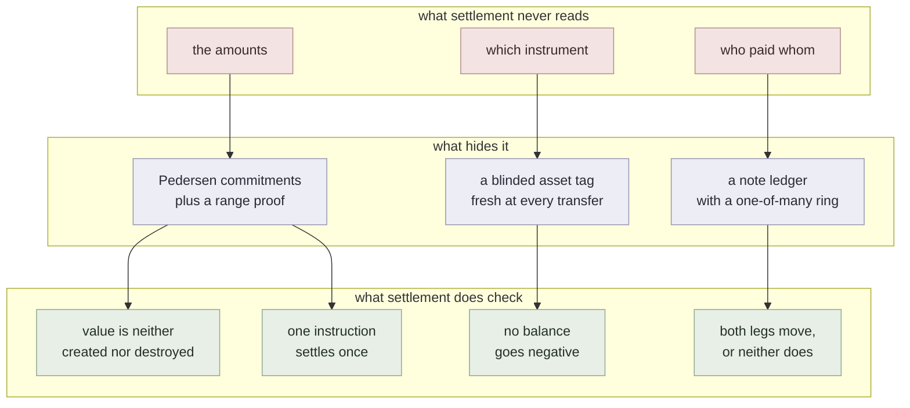
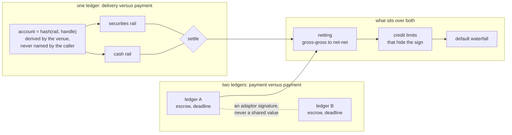

# defmi

**DeFMI** is a *decentralized financial market infrastructure*. The term of art is borrowed deliberately: an FMI is what the CPMI-IOSCO principles govern --- a payment system, a securities settlement system, a central counterparty --- and the claim here is that this is one, run by no single operator and unable to read what it settles.

Delivery versus payment for committed holdings: two legs that move together or not at all.

> Research software; do not deposit real assets. Native note spends use a pinned,
> experimental Triptych implementation, not an independently audited production
> cryptographic stack. The current version rejects legacy proof bytes and
> unversioned stored state; it does not silently reset or migrate balances.
> See [security findings and upgrade requirements](docs/NOTE_PROOF_SECURITY_REVIEW_20260905.md).
> In this native rail, asset IDs and settlement metadata remain public; amount
> and wallet-key confidentiality must not be described as hiding every field.

## Deployment target

The deployment target is a dedicated **non-EVM Avalanche L1**. `rust/qomm-avalanche-vm/` contains the Rust state machine, while `avalanche/defmivm/` contains configuration and five-validator acceptance launchers. The full gate covers account-free notes, pre-authorized reserves, seven-party MPC zkPI, atomic multi-RFQ settlement, shared legal-entity caps, restart recovery, and state-root agreement. AvalancheGo remains an external consensus host and launches the Rust VM over RPCChainVM protocol 45.


## What it does

Application-neutral pretrade note reservations are described in the
[Japanese integration guide](docs/APPLICATION_NOTE_RESERVATIONS_JA.md).
They bind a DeKYX-verified participant mandate to an anonymous-note lock and a
credit-facility update, with full monetary proofs verified by each Rust VM.
This new path does not require an RFQ ticket or a Maker/Taker role. Its OCLOB
settlement consumption, partial fills, release operations and recipient-owned
claim redemption are implemented. A separate OCLOB Docker acceptance connects
corporate pretrade, seven-node MPC and five-validator settlement; it is not
independent-operator or production-security acceptance. The guide distinguishes
this path from the existing QOMM settlement rail.

The native application rail also accepts [atomic groups of fills](docs/APPLICATION_FILL_BATCH_JA.md).
Each signed instruction binds its position and the complete ordered group; it
cannot be extracted for standalone settlement. VM tests cover cumulative holds
and rollback. Live OCLOB multi-fill integration is a separate acceptance gate.



## What it is made of



Generated from one shared research tree, which is why the layout is regular
across the three repositories. This repository is nevertheless self-contained:
its tests, locks, measurements and source do not require the private working
tree.

## What is here

Rust crates:

- `rust/qomm-defmi`
- `rust/qomm-proofs`
- `rust/qomm-zk`
- `rust/qomm-zkpi`
- `rust/qomm-measure`
- `rust/qomm-sim`
- `rust/qomm-dsl`
- `rust/qomm-mpc`
- `rust/qomm-transport`
- `rust/qomm-audit`
- `rust/qomm-avalanche-vm`
- `rust/zkpi-defmi-sdk`
- `rust/qomm-harness`

`zkpi-defmi-sdk` separates two signed reservation documents. A
`ReservationAdmission` lets a matching node check the private order's binding
and reserved amount without receiving a ledger identifier. The confidential
`ReservationPermit` names the anonymous entity, asset, facility, escrow note
and delegation needed for account-free settlement. Applications keep this full
permit under threshold encryption until their matching result authorizes
settlement. Sending a full permit to every matching node would leak the order
side through its asset and public ledger references.

Admission uses a fresh Pedersen reblinding of the reserved amount; exposing the
canonical amount commitment would also allow a ledger lookup. The wallet keeps
the reblinding difference private with the settlement authority so a later
verifier can reconcile the two commitments without learning the amount.
`order_authorization_commitment` similarly uses a fresh secret salt to bind
the ledger authorization to the application's order. Issuer-keyed HMAC tags
identify repeated use of one hold without publishing its identifier. Keep the
issuer key stable while reservations remain active, or migrate the complete
spent-tag history under a governed key-rotation procedure.

An authorized issuer calls `ReservationPermit::issue_from_application_reservation`
for the role-neutral path, or `issue_from_avalanche` for the existing QOMM path,
with its own trusted Avalanche client. The SDK reads both the anonymous-note reservation
and its credit hold, checks that they share one unchanged canonical root, and
reconciles the creation receipt, privately bound order commitment, asset, amount,
sequence, active status and expiry before signing. A concurrent ledger update
or a missing read fails the request; the caller may retry the whole read.
The signature attests to the issuer's readback. It is not a consensus proof,
and settlement must still consume the live hold atomically. The issuing
service must authenticate the participant and keep its signing key outside
the application coordinator.

Measurement binaries carried by `qomm-harness`:

- `build_defmi_doc`
- `build_settlement_contexts`
- `issue_external_kyb`
- `qomm_hsm_signer`
- `run_avalanche_l1_acceptance`
- `run_deccp`
- `run_defmi`
- `run_pretrade_reservations`
- `run_reconcile`
- `settle_finalized_batch`
- `run_viewing`

`artifacts/` holds the measurements the numbers in the paper are taken from, as
the binaries wrote them. Each carries the host it ran on as a label (`host-a`,
`host-b`, `host-c`) rather than a machine name; the private mapping back
to real machines is not published.

## Documents

- [`DEFMI.md`](DEFMI.md) --- the settlement layer: what it proves and what it refuses
- [`REGULATION.md`](REGULATION.md) --- which accounts and which statutes a live deployment touches, in Japan and in four other jurisdictions
- [`POSITION.md`](POSITION.md) --- what is new here and what is not, stated line by line against the nearest prior work
- [`REVIEW.md`](REVIEW.md) --- what two rounds of review found, including what was checked and found sound
- [`ZKPI_WIRE.md`](ZKPI_WIRE.md) --- the bytes an instruction travels as, the vectors to check an implementation against, and where it can run
- [`doc/ja/DEFMI_ZKPI_USE_CASES.md`](doc/ja/DEFMI_ZKPI_USE_CASES.md) --- non-QOMM uses for proof-carrying instructions and decentralized settlement, with prior art and an implementation order

## Dependencies and application hosts

The standard DeFMI VM is application-independent. It imports the generic
financial and proof crates and [DeKYX](https://github.com/shukob/dekyx) through
its locked dependency graph. It has no Aethel or application-specific DeCCP
adapter dependency.

Applications implement `ApplicationRuntime` in their own repository and compose
a dedicated VM using `QommVm::with_application`. The default VM rejects application
requests and stored application state. Aethel owns its receivable proofs,
clearing composition, application state and `aethel-defmi-host` binary.

[Application boundary and migration](docs/APPLICATION_INDEPENDENCE_JA.md) explains
the generic entry point, persistence validation and handling of older snapshots.

## Enterprise PoC

[Enterprise PoC guide (Japanese)](docs/ENTERPRISE_POC_JA.md) explains the
installation, role separation, failure cases, evidence to retain and acceptance
criteria for a company-run evaluation.

## Running it

```sh
cd rust
cargo test -j 4 --locked --workspace
```

## Measurements

Every reported number has an artifact and a Rust binary that produces it. Where a
measurement needs something not shipped here --- MP-SPDZ, a second host, a market
data feed --- the binary says so and fails rather than substituting a default.

## License

MIT. See `LICENSE`.
