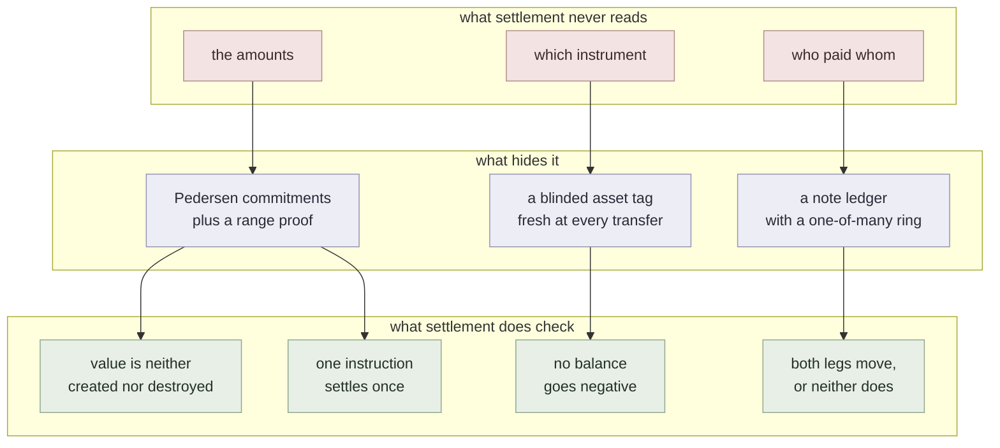
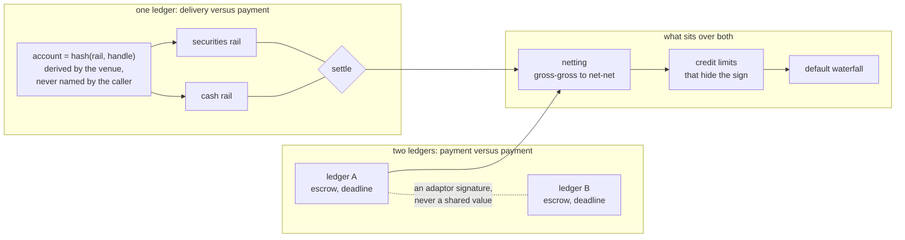

# defmi

**DeFMI** is a *decentralized financial market infrastructure*. The term of art is borrowed deliberately: an FMI is what the CPMI-IOSCO principles govern --- a payment system, a securities settlement system, a central counterparty --- and the claim here is that this is one, run by no single operator and unable to read what it settles.

Delivery versus payment for committed holdings: two legs that move together or not at all.

## Deployment target

The deployment target is a dedicated **non-EVM Avalanche L1**. `avalanche/defmivm/` contains the custom VM and a one-command five-AvalancheGo-process acceptance run covering asset registration, account creation, atomic multi-leg settlement, replay rejection, restart recovery and state-root agreement. The `evm/` directory is retained only as a historical comparison benchmark; it is not the product execution path.


## What it does



## What it is made of



Generated from one shared research tree, which is why the layout is regular
across the three repositories. This repository is nevertheless self-contained:
its tests, locks, measurements and source do not require the private working
tree.

## What is here

Rust crates:

- `rust/qomm-defmi`
- `rust/qomm-proofs`
- `rust/qomm-zk`
- `rust/qomm-zkpi`
- `rust/qomm-measure`
- `rust/qomm-sim`
- `rust/qomm-harness`

Measurement binaries carried by `qomm-harness`:

- `build_defmi_doc`
- `ed_reference`
- `run_avalanche_l1_acceptance`
- `run_deccp`
- `run_defmi`
- `run_evm`
- `run_reconcile`
- `run_viewing`

`artifacts/` holds the measurements the numbers in the paper are taken from, as
the binaries wrote them. Each carries the host it ran on as a label (`host-a`,
`host-b`, `host-c`) rather than a machine name; the private mapping back
to real machines is not published.

## Documents

- [`DEFMI.md`](DEFMI.md) --- the settlement layer: what it proves and what it refuses
- [`REGULATION.md`](REGULATION.md) --- which accounts and which statutes a live deployment touches, in Japan and in four other jurisdictions
- [`POSITION.md`](POSITION.md) --- what is new here and what is not, stated line by line against the nearest prior work
- [`REVIEW.md`](REVIEW.md) --- what two rounds of review found, including what was checked and found sound

## Depends on

- [qomm](https://github.com/shukob/qomm)

Cargo resolves these repositories from the checked-in lock file.

## Running it

```sh
cd rust
cargo test -j 4 --locked --workspace
```

## Measurements

Every reported number has an artifact and a Rust binary that produces it. Where a
measurement needs something not shipped here --- MP-SPDZ, a second host, a market
data feed --- the binary says so and fails rather than substituting a default.

## License

MIT. See `LICENSE`.
