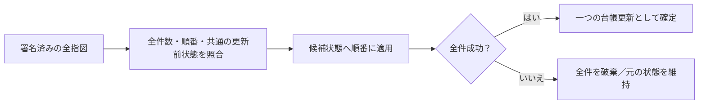

# 複数約定の一括決済

同じ買い注文が複数の売り注文と約定した場合、決済指図を順に送るだけでは途中まで確定する可能性がある。新しい `defmivm.issueApplicationNoteFillBatch` は2〜8件を一つの台帳更新として処理する。

## 保証すること

- 各指図の既存の委員会署名に、集合の要約、順番、全件数を含める。要約には対象基盤、共通の更新前状態、全件の操作識別子を順序付きで含める。
- 一部だけの送信、順番の変更、別の指図の混入、署名済みの構成要素の単独送信を拒否する。外側の配列だけに頼らない。
- VMは候補状態に全件を順番に適用する。共通の更新前状態を署名対象にしつつ、各予約枠の残高・通番・直前指図の要約は直前の処理結果と照合する。
- どれか一件でも不正なら、保有記録、予約枠、保証枠、受取権、使用済み識別子の変更を全て破棄する。全件成功時だけ一つの状態遷移として確定する。
- 全体の確定記録は集合の要約を返す。各予約枠には、その枠を最後に更新した個別指図の要約を残す。

## 利用時の注意

`ApplicationNoteFillBatch { version: 1, fills }` を `AvalancheNoteBridge::settle_application_batch` へ渡す。署名前に各指図の `batch` を設定する。`application_fill_group` で得た同じ集合要約と、0から始まる順番、全件数を使う。署名後に設定・削除すると検証に失敗する。単一約定では従来どおり `batch: None` とする。

同じ予約枠を複数回使う場合、2件目以降の入力は先行指図を適用した残高・通番・直前指図の要約に基づく。送信前の計算結果はあくまで予測であり、台帳の確定記録ではない。署名済み集合の更新前状態が古くなった場合は拒否される。並行する別取引による状態更新、再署名、障害回復はアプリケーション側でも扱う必要がある。

全体はVMの1 MiBの取引上限内に収める。2〜8件という件数上限に収まっても、証明を含めた実際のサイズが大きければ受け付けない。本方式は複数DeFMI間の原子的決済や、検閲・停止を防ぐ保証ではない。

## 検証済み範囲（2026-09-05）

Softbank上のDockerで `qomm-defmi`、`qomm-avalanche-vm`、`zkpi-defmi-sdk` の319件のreleaseテストと、全対象の警告をエラー扱いするClippyが成功した。実際の暗号証明を使ったVMテストで、累積予約枠の更新、状態保存後の再読込、再送拒否、要素抜出し・欠落・並替えの拒否、2件目の不正時に全状態が不変であることを確認した。

これはVM・SDKの検証であり、実ネットワークでの複数約定、独立運営者間の通信、暗号監査、本番性能を保証するものではない。OCLOB側の7 MPCノードと5バリデータによる接続検証は別途実施する。
