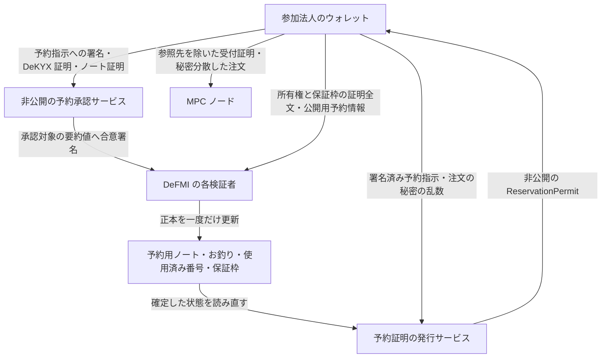

# アプリケーション共通の匿名ノート予約

この経路は、注文を出す前に、参加法人が保有する資金・在庫の一部を DeFMI 上で確保する。口座番号を公開して残高を変更するのではなく、所有権を証明した既存のノートから、予約用ノートとお釣りのノートを作る。

OCLOB では一つの指値注文が、到着時には既存注文と約定し、残量は板に残る場合がある。そのため、予約を Maker/Taker のいずれかに固定しない。RFQ の受付票や価格提示方針を架空に登録することもない。QOMM 向けの既存の予約経路とは、API と状態を分離している。

## 実装範囲

今回の経路が提供するのは、次の範囲である。

- アプリケーション、取引市場、DeFMI、MPC 委員会の版に結び付いた予約設定。
- 参加法人が約定前に署名する、対象資産・最大使用量・有効期限・決済条件を限定した予約指示。
- DeKYX による資格証明の検証。資格の発行者、適用範囲、必要資格、失効情報は承認サービス側で指定する。
- ノートの所有権、資金不足の防止、保証枠の保存則を示す証明全文の検証。
- 正本の保証枠更新、入力ノートの使用済み記録、予約用ノートとお釣りの作成を一つの状態更新で処理する Rust VM。
- 正本を読み直してから、注文を MPC ノードへ受け付けるための非公開の予約証明 `ReservationPermit` を発行する SDK。

この経路の予約ノートを OCLOB の共同生成 zkPI で消費する処理、部分約定後の残量更新、取消・期限切れ時の解除は、まだこの経路には実装されていない。実資金を預けるための完成版ではない。既存の QOMM 用解除 API を流用してはならない。

## 情報の流れ

承認サービスの署名だけで金銭的な正しさを済ませない。各 DeFMI 検証者は、正本から復元したノートの候補集合に対して、所有権・残高・保証枠の証明を自分で検証する。

一方、DeKYX 証明と参加者の予約署名は非公開の承認サービスが検証する。この部分まで Rust VM が直接検証している、あるいは承認サービスへの信頼が不要になった、とは主張しない。

## 予約指示と本人確認証明を作る順序

予約指示は `ApplicationReserveMandate` で表す。

1. DeKYX の資格証明と、法人に対応する保証枠を用意する。
2. 注文の内容を隠す乱数を生成し、公開する注文の要約値とは別の `request_commitment` を計算する。SDK の `order_authorization_commitment` を使う。
3. 予約設定、保証枠、予約番号、資産、数量の秘匿値、法人の識別用要約値、資格証明の要約値、非公開の決済条件、有効期限を指定して予約指示へ署名する。
4. `mandate.identity_context(requirement.scope_digest)` で、この署名済み予約指示だけを対象にした DeKYX 証明の文脈を作る。
5. DeKYX の `AnonymousPresentation::create` で、その文脈に対する証明を作る。
6. `mandate.spend_context()` を対象として、入力ノートの所有権と出力額の正しさを証明する。保証枠の更新についても `CreditFacilityRelationProof` を作る。

予約指示が保持するのは、既に存在する**資格証明の要約値**であって、後から生成する本人確認証明の要約値ではない。これにより「署名を作るために証明が必要で、証明を作るために署名が必要」という循環を避ける。本人確認証明を作り直しても、同じ資格証明と署名済み予約指示に結び付く。

承認サービスは `VerifiedApplicationNoteReservation::verify` を使う。資格証明の検証には、独立した DeKYX リポジトリの実装を使う。参加者から送られた「検証済み」というフラグや、本人確認結果の要約値だけを受け入れる API ではない。

## 正本での更新

`defmivm.issueApplicationReserveScope` で登録する設定は、同じアプリケーション・市場・DeFMI・委員会の版について変更できない。委員会を更新する場合は新しい版として登録する。

`defmivm.issueApplicationNoteReservation` は、以下を確認してから状態を更新する。

1. 予約設定が登録済みであり、予約指示が有効期限内である。
2. 承認署名が、証明全文のハッシュを含む今回の予約と、直前の正本の要約値に一致する。
3. 予約番号、操作番号、同じ設定内の問い合わせ用要約値が未使用である。
4. 保証枠が有効で、資産と法人が一致し、更新前の版・利用可能額・予約額・利用済み額が正本と一致する。
5. 入力候補ノートが正本に存在し、同じ資産で、他の予約にロックされておらず、使用済み番号が未登録である。
6. 証明全文が、正本の候補ノート集合と出力ノートに対して有効である。
7. 出力には、指定された金額の秘匿値を持つ予約ノートがちょうど一つ存在する。それ以外の出力には他の予約ロックを作らない。

成功時は、保証枠の利用可能額を減らして予約額を増やし、保証枠の版を進める。同時に入力の使用済み番号、出力ノート、予約の記録を保存する。失敗時に一部だけ更新されることはない。

同じ枠をもとに二つの予約が同時に作られた場合、最初に確定した更新で版と金額が変わる。後続の古い更新は拒否される。同じノートを別の予約番号で再利用しようとしても、所有権証明に結び付いた使用済み番号によって拒否される。失敗した参加者は、正本を再取得してから証明を作り直す必要がある。

正本の読み取り API は `defmivm.applicationReserveScope` と `defmivm.applicationNoteReservation`。新しい予約情報は、状態の要約値と保存・復元の整合性検査にも含まれる。

## 予約証明の発行と、注文の秘匿

SDK の `ReservationPermit::issue_from_application_reservation` は、参加者が提示した台帳スナップショットを信用しない。発行サービスが設定した DeFMI クライアントを使い、正本の要約値→予約→保証枠の予約→正本の要約値、の順に読み取る。

四つの読み取りが同じ状態を指し、予約指示が正本に完全一致し、予約が未消費・未更新である場合だけ証明を発行する。状態が途中で変化した場合は、取得からやり直す。

この `ReservationPermit` 自体には、資産や予約ノートの参照先が含まれる。そのまま各 MPC ノードへ渡してはいけない。ノード用には、別の `ReservationAdmission` を使う。

- 正本の資産・保証枠・ノート・法人の参照先を除く。
- 数量を隠す乱数を変更し、正本の数量秘匿値との単純な照合を防ぐ。
- 予約証明を再発行しても変わらない発行者付きの使用制限タグを使う。
- 元の予約証明と乱数の差は、注文ごとのしきい値暗号で保護する。

正本では、資産の種類、予約時刻、予約の有無、法人のスコープ内要約値などは公開される。口座番号を載せないことは、通信のタイミングやすべての関係性まで隠す保証ではない。問い合わせの存在を隠す運用は、通信量の均一化なども含めて別に評価する。

## 検証と未完了の接続

実行用コードと検証箇所は次のとおり。

- `rust/qomm-defmi/src/application_reservation.rs`: 予約指示、DeKYX との接続、公開用情報、証明全文の検証。
- `rust/qomm-avalanche-vm/src/execution/application_reservation.rs`: 正本を使った検証と一括更新。
- `rust/zkpi-defmi-sdk/src/reservation.rs`: 正本からの予約証明発行。
- `rust/qomm-defmi/tests/application_reservation.rs`: 実際に発行した DeKYX 資格証明と暗号証明を使う試験。
- `rust/qomm-avalanche-vm/src/execution.rs`: 改ざん、枠の不一致、再送、保存・復元を含む VM 試験。

SDK の読み取り試験は単体試験であり、実ネットワークの検証には数えない。VM の状態更新試験も、複数運営者による Avalanche L1 の稼働実績とは区別する。

次の接続では、予約の正本参照先と、MPC 内で使う再乱数化後の数量秘匿値を結び付け、共同生成した zkPI が予約ノートを直接消費できるようにする。約定後に参加者へ追加の署名や注文の原文を要求する方式へ戻さない。
