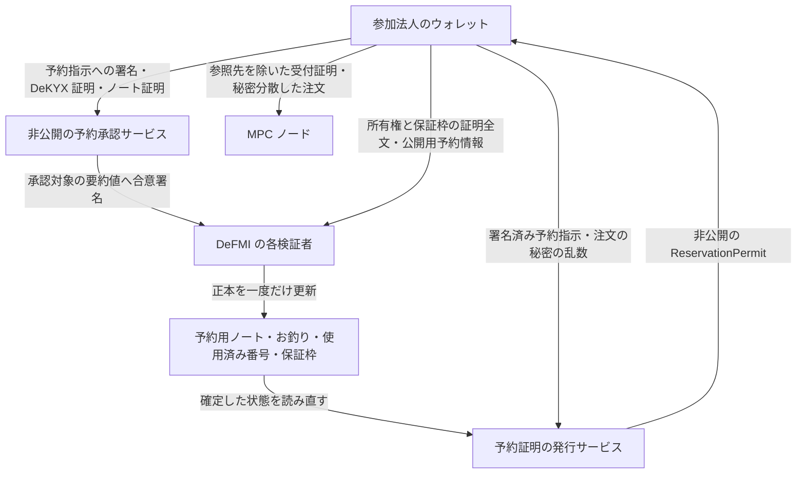
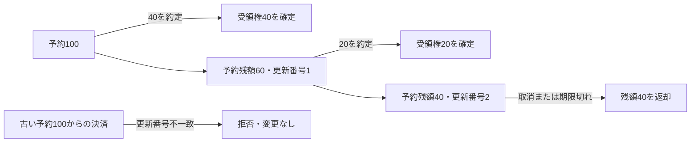

# アプリケーション共通の匿名ノート予約と決済

この経路は、注文を出す前に、参加法人が保有する資金・在庫の一部を DeFMI 上で確保する。口座番号を公開して残高を変更するのではなく、所有権を証明した既存のノートから、予約用ノートとお釣りのノートを作る。

OCLOB では一つの指値注文が、到着時には既存注文と約定し、残量は板に残る場合がある。そのため、予約を Maker/Taker のいずれかに固定しない。RFQ の受付票や価格提示方針を架空に登録することもない。QOMM 向けの既存の予約経路とは、API と状態を分離している。

## 実装範囲

今回の経路が提供するのは、次の範囲である。

- アプリケーション、取引市場、DeFMI、MPC 委員会の版に結び付いた予約設定。
- 参加法人が約定前に署名する、対象資産・最大使用量・有効期限・決済条件を限定した予約指示。
- DeKYX による資格証明の検証。資格の発行者、適用範囲、必要資格、失効情報は承認サービス側で指定する。
- ノートの所有権、資金不足の防止、保証枠の保存則を示す証明全文の検証。
- 正本の保証枠更新、入力ノートの使用済み記録、予約用ノートとお釣りの作成を一つの状態更新で処理する Rust VM。
- 正本を読み直してから、注文を MPC ノードへ受け付けるための非公開の予約証明 `ReservationPermit` を発行する SDK。
- 委員会が共同署名した zkPI と証明全文に基づく、予約の部分消費、資産の受領権の確定、残額の継続予約。
- 委員会が承認した取消と、委員会が停止していても実行できる期限切れ解除。
- 同じ署名済み取引の再送と、確定結果の取り違えを防ぐクライアント処理。

**この DeFMI 経路を OCLOB の実稼働するノード群へつなぐ作業は未完了である。** 正本の決済処理があることと、OCLOB の注文受付から決済までがこの経路へ切り替わったことは区別する。実資金を預けるための完成版ではない。既存の QOMM 用解除 API を流用してはならない。

## 情報の流れ

承認サービスの署名だけで金銭的な正しさを済ませない。各 DeFMI 検証者は、正本から復元したノートの候補集合に対して、所有権・残高・保証枠の証明を自分で検証する。

一方、DeKYX 証明と参加者の予約署名は非公開の承認サービスが検証する。この部分まで Rust VM が直接検証している、あるいは承認サービスへの信頼が不要になった、とは主張しない。

## 予約指示と本人確認証明を作る順序

予約指示は `ApplicationReserveMandate` で表す。

1. DeKYX の資格証明と、法人に対応する保証枠を用意する。
2. 注文の内容を隠す乱数を生成し、公開する注文の要約値とは別の `request_commitment` を計算する。SDK の `order_authorization_commitment` を使う。
3. 予約設定、保証枠、予約番号、資産、数量の秘匿値、法人の識別用要約値、資格証明の要約値、非公開の決済条件、有効期限を指定して予約指示へ署名する。
4. `mandate.identity_context(requirement.scope_digest)` で、この署名済み予約指示だけを対象にした DeKYX 証明の文脈を作る。
5. DeKYX の `AnonymousPresentation::create` で、その文脈に対する証明を作る。
6. `mandate.spend_context()` を対象として、入力ノートの所有権と出力額の正しさを証明する。保証枠の更新についても `CreditFacilityRelationProof` を作る。

予約指示が保持するのは、既に存在する**資格証明の要約値**であって、後から生成する本人確認証明の要約値ではない。これにより「署名を作るために証明が必要で、証明を作るために署名が必要」という循環を避ける。本人確認証明を作り直しても、同じ資格証明と署名済み予約指示に結び付く。

承認サービスは `VerifiedApplicationNoteReservation::verify` を使う。資格証明の検証には、独立した DeKYX リポジトリの実装を使う。参加者から送られた「検証済み」というフラグや、本人確認結果の要約値だけを受け入れる API ではない。

## 正本での更新

`defmivm.issueApplicationReserveScope` で登録する設定は、同じアプリケーション・市場・DeFMI・委員会の版について変更できない。委員会を更新する場合は新しい版として登録する。

`defmivm.issueApplicationNoteReservation` は、以下を確認してから状態を更新する。

1. 予約設定が登録済みであり、予約指示が有効期限内である。
2. 承認署名が、証明全文のハッシュを含む今回の予約と、直前の正本の要約値に一致する。
3. 予約番号、操作番号、同じ設定内の問い合わせ用要約値が未使用である。
4. 保証枠が有効で、資産と法人が一致し、更新前の版・利用可能額・予約額・利用済み額が正本と一致する。
5. 入力候補ノートが正本に存在し、同じ資産で、他の予約にロックされておらず、使用済み番号が未登録である。
6. 証明全文が、正本の候補ノート集合と出力ノートに対して有効である。
7. 出力には、指定された金額の秘匿値を持つ予約ノートがちょうど一つ存在する。それ以外の出力には他の予約ロックを作らない。

成功時は、保証枠の利用可能額を減らして予約額を増やし、保証枠の版を進める。同時に入力の使用済み番号、出力ノート、予約の記録を保存する。失敗時に一部だけ更新されることはない。

同じ枠をもとに二つの予約が同時に作られた場合、最初に確定した更新で版と金額が変わる。後続の古い更新は拒否される。同じノートを別の予約番号で再利用しようとしても、所有権証明に結び付いた使用済み番号によって拒否される。失敗した参加者は、正本を再取得してから証明を作り直す必要がある。

正本の読み取り API は `defmivm.applicationReserveScope` と `defmivm.applicationNoteReservation`。新しい予約情報は、状態の要約値と保存・復元の整合性検査にも含まれる。

## 部分約定と残額の管理

`defmivm.issueApplicationNoteFill` は、一つの証券予約と一つの資金予約を同時に処理する。依頼には、正本の直前の要約値と、両予約の「更新番号・現在の金額の秘匿値・直前の処理の要約値」を含める。

委員会は通常の zkPI への署名に加え、この依頼全体にも共同署名する。後者は、予約の参照先、使用する委員会、MPC 計算結果の要約値、証明全文、受領者向け暗号文、残額を板に残すかどうかを一つに結び付けるための署名である。参加者が価格を見た後に追加署名する工程ではない。

各 DeFMI 検証者は次を確認する。

1. 直前の正本と両予約の状態が一致する。予約は有効期限内であり、まだ使用できる状態にある。
2. 署名者の公開鍵が、予約時に固定した委員会の公開鍵と一致する。依頼全体への共同署名が有効である。
3. zkPI の署名と数量・価格の範囲証明が有効であり、指定した MPC 計算結果に結び付いている。
4. zkPI 内の資産と、正本で消費する証券資産が一致する。
5. 資金額が数量×価格に等しいこと、両側の残額が負にならないことを、証明全文から確認できる。
6. 受領者向けの暗号文が、今回の zkPI と指定受領者を対象としている。
7. zkPI の使用済み番号と依頼の操作番号が、どちらも未使用である。

初回の約定で、予約ノートに対応する使用済み番号を一度だけ記録する。以降は元のノートを再使用せず、予約の現在残額を消費する。原予約の記録は変更せず、現在残額・更新番号・直前の処理記録を別に持つ。

図は一方の資産だけを示している。実際には証券側と資金側が一括更新される。一方だけ成功することはない。片方の注文だけを終了させ、相手の残額予約を継続することもできる。

保証枠では、約定額を予約額から利用済み額へ移す。注文を終了させる場合は残額を利用可能額へ戻す。各予約に属する金額の保存則を検証するので、保証枠全体の残高や乱数を一か所へ復元する必要はない。

同じ予約から二つの約定を同時に提出した場合、最初の更新で予約の番号と残額が変わり、古い状態を参照する後続の更新は拒否される。署名対象には正本全体の要約値も含むため、別の取引による正本更新でも再提出が必要になる場合がある。これは現在の直列化方式であり、高い処理件数を保証するものではない。

### MPC 用の秘匿値と正本の秘匿値をどう一致させるか

注文受付では、正本との単純な照合を防ぐため、金額を隠す乱数を変更している。MPC はその変更後の値で計算・証明する。

約定時には、署名された依頼内の乱数差を使って、MPC が証明した残額の秘匿値を正本の表現へ戻す。同じ差を受領者向け暗号文の乱数成分からも引く。数量や金額そのものは復号しない。利用者が暗号文を復号したときに、正本と一致する残額と乱数を得られる。

残額を予約し続ける間は、この暗号文も正本に保存する。そのため、途中でアプリケーションやノードが停止しても、後の期限切れ解除には新しい暗号文や署名を要求しない。

## 取消と期限切れの返却

`defmivm.issueApplicationNoteRelease` は二つの理由を区別する。

- **取消:** 予約時に許可された委員会の共同署名が必要。約定との順序を揃えるためであり、参加者が結果を見て決済だけを拒否する機能ではない。
- **期限切れ:** 正本のブロック時刻が予約の有効期限を過ぎていれば、署名なしで提出できる。有効期限ちょうどの時刻では、まだ解除できない。資産の返却先を提出者が選ぶことはできない。

一度も約定していなければ、原予約ノートの受領者・金額・暗号文をそのまま使い、予約ロックだけを外したノートを作る。参加法人は、予約時点で自分が回収できるウォレットをこのノートの受領者にしておく必要がある。

部分約定済みなら、最後に確定した残額と受領者向け暗号文から返却の受領権を作る。元の予約全額は返さない。保証枠の新規利用が停止されていても、残額の返却は可能である。既に取消・全消費した予約、古い更新番号による解除、同じ解除の二重適用は拒否する。

受領権は決済時点で確定し、取引を後から拒否するための追加同意ではない。`issueNoteClaimRedemption` では、受領者が署名した依頼を各 Rust VM が直接検証し、受領権を支出可能ノートへ移す。取引の成立・不成立を選び直す署名ではなく、既に受け取った資産の移し先を指定する操作である。署名しなくても元の決済は取り消せない。

## 受領権をウォレットで使う

法人側は、正本にある受領権の暗号文を自分の秘密鍵で開き、数量と乱数が確定済みの値と一致することを確認する。その値を保ったまま、移し先ウォレットだけが使えるノートを作る。`claim_redemption::redeem_claim` がこの処理を行う。

依頼には、DeFMIの識別子、更新前の正本、操作番号、受領権の番号、移し先ノート、受領者の署名を含める。署名は既存の [FROST Ristretto255の単独署名機能](https://docs.rs/frost-ristretto255/latest/frost_ristretto255/type.SigningKey.html) を利用する。移し先ウォレットの長期公開鍵や、数量・乱数の平文は送らない。検証には、受領権の暗号文に既に記録されている受領者の鍵を使う。これは新しい匿名化暗号の発明ではなく、既存署名の用途別の結合である。

VMは、受領権が未使用であること、資産と数量の秘匿値が変わっていないこと、ロックのない出力であること、正しい受領者が依頼全体に署名したことを確認する。ノート作成と受領権の使用済み化を一括で行う。同じ受領権を別の出力に取り込むことはできない。

新しいアプリケーション予約から生じた受領権は、承認者の署名と証明の要約値だけを使う旧 `issueNoteClaimMaterialization` では処理できない。旧方式の受領権には互換APIが残っているため、そちらまで同じ保証に変わったとは扱わない。

取引時の仮名の受取先は既に公開情報であり、この操作が過去の結び付きを消すわけではない。暗号化断片の中身が正しいかという問題も別であり、復号結果が数量の秘匿値と違う場合には処理を止める。

## クライアントの再送と確定確認

`AvalancheNoteBridge::settle_application` と `release_application` は、署名済み依頼をそのまま送信する。現在の正本に合わせて署名対象を書き換えたり、参加者への署名要求を追加したりしない。

クラッシュ後は同じ依頼を再送できる。既に確定済みなら、VM の取引受付処理が以前の取引番号を返す。クライアントは、取引番号、依頼全体の要約値、更新前の正本、更新後の正本、確定した高さ、ブロック番号を確認する。これは設定された RPC 接続先の確定応答の照合であり、未実装のライトクライアントによる独立した合意証明ではない。

## 何が暗号証明され、どこに信頼が残るか

金額の保存、範囲、数量×価格、資産の対応は DeFMI が証明全文から確認する。一方、MPC の計算結果の要約値だけでは「最良価格だった」「順序通りに約定した」ことは分からない。これらの市場規則と、受領者へ送った暗号文の内容が正しいことは、指定された委員会の正しい実行に依存する。暗号文の宛先確認と、暗号文の中身までの証明は同じではない。

したがって OCLOB 接続時には、各ノードが実際に実行した MPC 計算、予約の許可条件、現在の残額と一致する依頼にだけ共同署名する必要がある。中央の調整役から任意のメッセージを受け取って署名する機能を、この接続の代わりにしてはならない。

取引確定後には予約の参照先と zkPI 内の仮名の受領者が公開される。金額の平文や口座番号は含まれないが、取引同士の対応関係まで完全に隠す保証ではない。

## 予約証明の発行と、注文の秘匿

SDK の `ReservationPermit::issue_from_application_reservation` は、参加者が提示した台帳スナップショットを信用しない。発行サービスが設定した DeFMI クライアントを使い、正本の要約値→予約→保証枠の予約→正本の要約値、の順に読み取る。

四つの読み取りが同じ状態を指し、予約指示が正本に完全一致し、予約が未消費・未更新である場合だけ証明を発行する。状態が途中で変化した場合は、取得からやり直す。

この `ReservationPermit` 自体には、資産や予約ノートの参照先が含まれる。そのまま各 MPC ノードへ渡してはいけない。ノード用には、別の `ReservationAdmission` を使う。

- 正本の資産・保証枠・ノート・法人の参照先を除く。
- 数量を隠す乱数を変更し、正本の数量秘匿値との単純な照合を防ぐ。
- 予約証明を再発行しても変わらない発行者付きの使用制限タグを使う。
- 元の予約証明と乱数の差は、注文ごとのしきい値暗号で保護する。

正本では、資産の種類、予約時刻、予約の有無、法人のスコープ内要約値などは公開される。口座番号を載せないことは、通信のタイミングやすべての関係性まで隠す保証ではない。問い合わせの存在を隠す運用は、通信量の均一化なども含めて別に評価する。

## 検証と未完了の接続

実行用コードと検証箇所は次のとおり。

- `rust/defmi/src/application_reservation.rs`: 予約指示、DeKYX との接続、公開用情報、証明全文の検証。
- `rust/defmi-avalanche-vm/src/execution/application_reservation.rs`: 正本を使った検証と一括更新。
- `rust/defmi/src/application_settlement.rs`: 共同署名、zkPI と金額の証明全文、残額暗号文の正本向け変換。
- `rust/defmi-avalanche-vm/src/execution/application_settlement.rs`: 部分消費・取消・期限切れ解除の一括更新。
- `rust/zkpi-defmi-sdk/src/reservation.rs`: 正本からの予約証明発行。
- `rust/defmi/src/avalanche.rs`: 依頼の送信、予約の現在残額の読み取り、確定結果の照合。
- `rust/defmi/tests/application_reservation.rs`: 実際に発行した DeKYX 資格証明と暗号証明を使う試験。
- `rust/defmi-avalanche-vm/src/execution.rs`: 改ざん、枠の不一致、再送、保存・復元を含む VM 試験。
- `rust/defmi-avalanche-vm/src/execution/tests/application_lifecycle.rs`: 実際の 3-of-7 共同署名と範囲・積の証明による連続部分約定、署名し直した改ざんの拒否、残額の復号、取消・期限切れ・再送の試験。

SDK の読み取り試験は単体試験であり、実ネットワークの検証には数えない。VM の状態更新試験も、複数運営者による Avalanche L1 の稼働実績とは区別する。

次の接続では、OCLOB の法人側 CLI/Docker による事前予約と、各 MPC ノードが実際の計算結果にだけ署名する処理を、この決済経路へつなぐ。受領権のノート化、実 L1 での稼働、複数ホスト間の通信、停止・復旧、UI も引き続き検証対象である。約定後に参加者へ追加の署名や注文の原文を要求する方式へ戻さない。

## 計算を担当したノードが決済を承認するための接続口

`ApplicationNoteFill::verify_unsigned` は、署名前の候補について金額・価格・残額などの証明を検証する。ここからは台帳更新を許可する型を返さない。VM が実行できるのは、従来どおり、委任された委員会の署名も検証した `verify` の結果だけである。

`qomm-transport::ProofParty` は、計算ごとに次の情報をノード自身の暗号化された保存領域へ残す。

- 実際に承認した zkPI と、照合結果の要約値。
- 選ばれた双方の匿名の受取先と、その計算に使った予約額のコミットメント。
- 自分が作った四つの暗号化受取情報。同じ情報を再度取りに来た場合は、同じ暗号文を返す。
- 一度承認した決済内容と、署名の一回限りの乱数の使用状態。

アプリケーション固有の検証処理は、この保存済み情報を受け取って候補と照合する。呼び出し元が送った「検証済み」というフラグは使わない。この接続口は Rust プロセス内部のインターフェースであり、任意のメッセージに署名する汎用 RPC は追加していない。

例えば OCLOB は、そのノードが署名付きで保存した約定番号・入力注文の承認情報・予約枠の解放条件とも照合してから、この接続口を呼ぶ必要がある。DeFMI の共通ライブラリだけで、どの価格条件や注文順が正しいかを判断するわけではない。

無関係な台帳更新で親の状態が変わった場合は、同一の決済内容について親だけを差し替えて再承認できる。ただし注文・予約枠・受取先・証明・解放条件を変えた別の決済へのすり替えは許可しない。台帳側でも、予約枠の版と支出済み識別子を照合する。古い保存形式で受取情報が残っていない計算は、この新しい承認には使えない。
