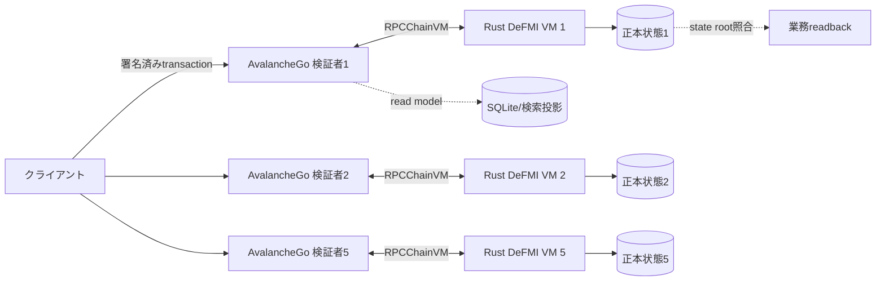

# DeFMI 企業向けPoC導入ガイド

## このPoCで確認すること

DeFMIは、資金、証券、予約、保証枠、一回限りの番号を正本状態として持ち、
検証済みzkPIに従ってDvPまたはPvPを原子的に処理する分散型金融市場基盤である。
現在の実行先はEVMではなく、専用Rust VMを動かすAvalanche L1である。

PoCでは次を確認する。

- 資金legと資産legが同時に動くか、どちらも動かない。
- 口座名を平文指定せず、事前予約した秘密口座・noteを一度だけ消費する。
- 古い状態根、二重使用、不足署名、保存則違反を全検証者が拒否する。
- 5検証者が同じ状態根へ到達し、停止・再起動後も正本を復元する。
- QOMM統合では、7 MPCノードの結果から追加署名なしで決済する。

これは研究用ネットワークであり、法的な決済最終性、中央銀行接続、CSD接続、
実資産の保管または商用SLAを提供するものではない。PoCでは合成資産と使い捨て鍵を使う。

## 推奨する担当者

| 担当 | PoCでの役割 |
|---|---|
| FMI設計担当 | 資産、参加者、予約、決済完了条件を定義する |
| 検証者運用担当 | AvalancheGoとRust VMを別障害領域で運用する |
| 資産管理担当 | 発行権限、担保、資金・証券noteの保存則を確認する |
| アプリ担当 | zkPI生成元とDeFMI取引を結ぶ |
| セキュリティ担当 | 鍵、ネットワーク、ログ、復旧、拒否試験を確認する |
| 法務・業務担当 | PoC上の状態と実務上の権利・最終性を対応づける |

## 必要な環境

- インターネットへ公開しないLinux環境。
- Git、Rust、`jq`、`curl`、`openssl`、`shasum`、標準的なUnixツール。
- 明示的に用意したAvalancheGo実行ファイル。
- 明示的に用意したavalanche-network-runner実行ファイル。
- QOMM統合試験では、公式MP-SPDZ checkout。

スクリプトは外部実行ファイルを自動取得しない。使用する版とSHA-256をPoC開始前に
承認し、最新の受入artifactに記録された組合せとの差を確認する。

リポジトリには `rust-toolchain.toml` がないため、PoC開始時に `rustc --version` を記録し、
承認した版を全build機で揃える。統合Docker buildが現在使う参照版はRust 1.97.1である。

## 1. ソースと基準試験を固定する

```sh
git clone https://github.com/shukob/defmi.git
cd defmi
git checkout <社内で承認したcommit>
git rev-parse HEAD

cd rust
cargo test -j 4 --locked --workspace
cd ..
```

ライブラリ試験は状態機械の確認であり、Avalanche consensus、複数検証者、プロセス分離を
確認しない。ネットワークPoCには次の段階が必要である。

## 2. Rust VMと受入ドライバを構築する

```sh
cd rust
env -u MP_SPDZ_ROOT cargo build -j 4 --release --locked \
  -p qomm-avalanche-vm --bin qomm-avalanche-vm \
  -p qomm-harness --bin run_avalanche_l1_acceptance
cd ..
```

上のように `MP_SPDZ_ROOT` を環境から外してbuildしたVMはlibSPDZをリンクしない。依存する
`qomm-mpc` のbuild scriptは `MP_SPDZ_ROOT` が設定されているとlibSPDZをlinkするため、単に
「VMは常に非link」とは扱わない。MPCを外部processとして使う配備では、環境を明示してbuildし、
成果物へ動的linkの検査結果を残す。

## 3. 5検証者の最小Avalanche L1を起動する

```sh
export AVALANCHEGO_PATH=/absolute/path/to/avalanchego
export AVALANCHE_NETWORK_RUNNER=/absolute/path/to/avalanche-network-runner

avalanche/defmivm/scripts/run-local-l1.sh
```

スクリプトは一時領域へVM plugin、genesis、5検証者のDB、ログ、SQLite投影を作り、
次を確認する。

- 5検証者がhealthyになる。
- Rust VMの正本状態遷移を各検証者が再実行する。
- 全検証者の状態根が一致する。
- 検証者再起動後に状態を回復する。

結果は `artifacts/avalanche_l1_acceptance.json` に書かれる。既存artifactを成功証拠として
再利用せず、PoC環境で新しく生成されたファイルの時刻、AvalancheGoとrunnerのSHA-256を
確認する。この最小artifact自体にはGit commitとVM binary SHA-256が入らないため、実行wrapperで
`git rev-parse HEAD` と `sha256sum rust/target/release/qomm-avalanche-vm` を別途採取して同じ試験IDへ
結び付ける。完全経路のartifactはVM情報も記録する。

失敗時の一時領域を調べる場合だけ、次を付ける。

```sh
export QOMM_KEEP_AVALANCHE_RUN=1
```

保持したディレクトリにはテスト鍵や状態が含まれ得るため、調査後は組織の手順で廃棄する。

## 4. 取引シナリオを確認する

PoC対象に応じて、少なくとも次を実行する。

### DvP

- 買い手資金noteと売り手証券noteを事前予約する。
- 正しいzkPIで両legが同時に移ることを確認する。
- 片側不足、期限切れ、二重提示では両legとも動かないことを確認する。

### PvP

- 異なる通貨資産を両側で予約する。
- 両DeFMI状態を一つの決済文脈へ束縛する。
- 片側だけの確定、古いroot、再送を拒否する。

### 担保・資金供給枠

- 国債等を模した担保noteを差し入れる。
- 担保評価、利用枠、引出、返済、担保解放を別状態として追跡する。
- 価格低下、枠超過、古い評価版を失敗側へ閉じる。

PoCの合成資産名を実在証券と同じにしても、法的権利や外部台帳との一致は生じない。

## 5. QOMMから追加署名なしで決済する

完全経路には公式MP-SPDZ checkoutが必要である。

```sh
export AVALANCHEGO_PATH=/absolute/path/to/avalanchego
export AVALANCHE_NETWORK_RUNNER=/absolute/path/to/avalanche-network-runner
export MP_SPDZ_ROOT=/absolute/path/to/MP-SPDZ

avalanche/defmivm/scripts/run-full-qomm-l1.sh
```

この受入では、外部KYB証拠、プロセス分離したCSD署名、7 MPC party、事前予約、
法人合計枠、同時RFQ、しきい値zkPI、複数約定の原子的DvP、追加署名なしの決済、
再起動回復を一つの経路で確認する。

結果は `artifacts/avalanche_qomm_full_acceptance.json` に書かれる。次を個別に確認する。

- `passed`相当の総合判定だけでなく、各不変条件が成功している。
- 決済前後の状態根、取引ID、ledger heightが存在する。
- 検証者再起動後のrootとheightが追い付く。
- 使用したAvalancheGo、runner、Rust VM、MP-SPDZの版またはSHA-256が記録される。
- DBを空にした検証者のcold join後に、heightとstate rootが追い付く。

## 6. 必須の拒否・障害試験

- 同じnote、予約、nullifier、zkPIの二回目使用。
- 数量保存則を破る遷移。
- 古いstate rootと古いpool sequence。
- 不足した認可、壊れた署名、別domainのzkPI。
- 同一法人の複数要求による合計枠超過。
- 同じMaker poolを使う同時配分。
- 検証者1台停止、複数台停止、再起動。DBを空にしたcold syncは§5の完全経路で実行する。
- GatewayまたはMPC停止中の受付と再送。
- 成立済み取引の同一バイト列再提示。

拒否後に、残高、予約、pool sequence、current note、状態根が変わっていないことを
読み戻す。ログ文字列だけの拒否確認では不足する。

## 7. 自社システムとの接続点

- 資産マスターからDeFMI asset IDへの対応。
- 法人マスターから秘密participant参照への対応。
- DeKYXの参加資格と法人グループ単位の上限。
- 保有・予約・利用可能額の社内台帳との照合。
- zkPI発行元のapplication ID、domain、公開鍵集合。
- DeFMI受領証から社内ステータスを更新する冪等な取込。
- 再送キューと、取引ID・nullifierによる重複排除。
- 手動介入、停止、取消、期限切れ、例外時の承認経路。

社内システムへは「送信済み」「mempool受理」「正本確定」「照合済み」を別状態で返す。
正本読戻し前に社内債権・残高を確定させない。

## 8. 保存する証拠

- Git commit、Cargo.lock、Rust VM、AvalancheGo、runner、MP-SPDZの版とSHA-256。
- genesisと設定のSHA-256、validator数、chain ID。
- 全検証者の前後状態根、height、取引ID、受領証。
- 予約、DvP/PvP、拒否、再送、再起動、cold syncの実行記録。
- 資産別の発行量・移転量・残高・予約量の保存則。
- API・ログ・SQLite投影に秘密のopeningや秘密鍵がないことの検査結果。

## 9. PoC合格条件

- 5検証者が同じRust VMを実行し、同じ状態根へ到達する。
- DvP/PvPが両leg同時か全拒否になる。
- 二重使用、古い状態、不足認可、保存則違反が正本を変えず拒否される。
- 検証者停止・再起動後に状態を回復し、§5の完全経路ではcold sync後も確定済み状態を
  再構築できる。
- QOMM統合では、7 MPCの結果が追加署名なしで一回だけ決済される。
- 自社投影はDeFMI受領証を冪等に取り込み、正本と一致する。

## 本番移行前に別途必要なもの

- 検証者の独立運営主体、参加・退出・更新・緊急停止の統治。
- HSM、鍵生成式、鍵更新、mTLS、DDoS対策、監視、バックアップ、災害復旧。
- 外部CSD・銀行・カストディ・中央銀行台帳との法的・技術的照合。
- 決済最終性、準拠法、倒産隔離、紛争処理、取消不能時点の定義。
- 外部コード監査、暗号監査、VM監査、性能・長時間・障害注入試験。

ローカルL1の成功は、実資産の法的移転や商用ネットワークの安全性を保証しない。

## 10. DeFMIを構成する技術

DeFMIは、単一の「スマートコントラクト」ではない。資産と決済の状態機械、秘密性を持つ
note、専用Rust VM、Avalanche L1、地域ごとの制度を記述するDSL、外部アプリ接続を組み合わせる。

| 層 | 実装 | 主な責任 |
|---|---|---|
| 合意層 | AvalancheGo | 検証者間のblock合意、network運用 |
| VM境界 | avalanche-rs由来のRPCChainVM | AvalancheGoと別processのRust VMを接続 |
| 実行層 | `qomm-avalanche-vm` | transaction検証、決定的実行、state root、再起動復元 |
| 金融状態機械 | `qomm-defmi` | 資産、note、予約、DvP/PvP、枠、担保、照合 |
| 配備設計 | `qomm-defmi-dsl` | FMI構造、運営者、台帳、link、不変条件をcompile・検証。現時点では統合開発ソースにあり、standalone公開レポには未収録 |
| 指図 | `qomm-zkpi` | 公開文へ束縛された一回限りの秘密決済指図 |
| アプリ接続 | `zkpi-defmi-sdk` | QOMM/OCLOB等の実行と正本readbackを一つの受領証へ結ぶ |

EVMは使わない。AvalancheGoをRustへ移植したものでもない。公式AvalancheGoが各検証者上で動き、
RPCChainVM protocol 45を介して別processのRust VMを起動する。したがって、AvalancheGoのGoコードを
RustからFFI呼出しする構成ではない。

## 11. 正本状態と投影DB

正本は、検証者がblockを同じ順序で再実行して得る決定的なVM状態である。SQLite投影、フロントの
表示、監視DB、社内会計DBは正本ではない。



投影DBは消して再構築できるようにする。投影の行があるだけで決済済みと判断せず、block ID、height、
transaction ID、前後state rootを正本から確認する。

状態更新は次を満たす。

- 同じblockと同じ前状態から、全検証者が同じbytesの後状態を得る。
- wall clock、乱数、filesystem順序、外部HTTP応答を実行結果へ直接使わない。
- mapや集合の反復順を正規化する。
- 算術overflowを拒否し、丸め規則を固定する。
- 失敗したtransactionは部分更新を残さない。

## 12. DeFMIが持つ資産表現

### 12.1 commitment残高台帳

残高をPedersen commitmentとして持つ方式である。台帳は金額を読まずに、移転前後で価値が
増減していないことと、残額が許容範囲にあることを証明から確認する。

本番相当では `Ledger::under_issuer` と認可済み発行を使う。試験用 `open` は発行者を確認しないため、
合成fixture以外へ使わない。発行認可はhandle、balance commitment、nonceへEd25519署名を結ぶ。

準備済み移転はpayer残高から一度引き、payeeへまだ加えずescrowとして台帳内に保持する。保存則の
計算はaccount残高とescrowの両方を含む。期限前に正しいreleaseを受ければpayeeへ移し、期限後なら
payerへ戻す。

### 12.2 口座名を持たないnote

note方式では、保有は公開口座番号でなく、一回限りの暗号noteとして存在する。受取人はview鍵と
spend鍵を分けて持つ。

- view鍵: 自分宛noteを発見できるが、移転できない。
- spend鍵: noteのserialを導き、支出を認可する。
- ephemeral point: 送信者が受取人向けの一回限りnoteを作るために使う。
- masked value/blinding: 正当なview鍵を持つ主体がnoteを判別するために使う。
- serial point: 支出時の二重使用防止に使うが、spend scalar自体は公開しない。

支出証明は、ring内のどれか一つを正当に使うこと、出力値が範囲内であること、入力と出力が保存
されることを確認する。ringが小さい、選び方が偏る、直前に作ったnoteをすぐ使う場合、暗号が正しく
ても匿名集合は小さい。運用側でring構成と待ち時間を測る。

### 12.3 scope別view鍵

監査法人、カストディ、内部監査へ全取引を見せるのではなく、目的や法域ごとにview scopeを分ける。
一つのscope鍵を渡しても他scopeのnoteを発見できない構成を使う。誰へ、どのscopeを、いつまで
渡したかを監査台帳へ記録する。

現在の `ViewingGrant` は `issued_at` と `expires_at` を署名対象に含めるが、途中失効を正本へ
登録・検証するrevocation機構は実装していない。期限前の権限停止が必要なPoCでは、配布を止める
だけで済ませず、host側の失効台帳を検証経路へ入れるか、短期grantを再発行する運用を明記する。

## 13. trustモデルを分ける

DeFMIには複数のしきい値がある。

| 条件 | 意味 | 同じではないもの |
|---|---|---|
| Avalanche validator合意 | blockとVM状態の順序を確定 | MPC秘密復元しきい値 |
| 5検証者 | 現在のPoC network構成 | 本番の推奨台数を保証しない |
| MPC k-of-n | 秘密計算を壊すために必要な結託 | validator quorum |
| FROST署名quorum | zkPIを認可する共同署名者数 | DeCCPの承認weight |
| cross-domain committee weight | 他DeFMIのfinality receiptを信頼する重み | local chain finality |

一つの組織が全validator、MPC node、FROST share、資産発行鍵を管理すれば、process数が多くても
独立性はない。PoC報告では「台数」だけでなく運営主体、管理account、region、HSM、root権限を示す。

## 14. 推奨ハードウェア

以下は開始構成であり、性能保証ではない。実際のtransactionサイズ、state成長、block頻度、証明
検証costを測って決める。

### 14.1 一台の機能確認

- 8 vCPU。
- メモリ16 GiB。
- 空きNVMe 100 GiB。
- Linux 64ビット。

5検証者を同じhostで起動できるが、障害耐性、独立運営、WAN性能の証拠にはならない。

### 14.2 5検証者PoC

| 役割 | 台数 | vCPU/台 | メモリ/台 | NVMe/台 | 備考 |
|---|---:|---:|---:|---:|---|
| AvalancheGo + Rust VM | 5 | 8 | 32 GiB | 500 GiB | 各台で独立DBとログ |
| API gateway | 2 | 4 | 8 GiB | 100 GiB | validator RPCを直接公開しない |
| indexer/read model | 2 | 8 | 16 GiB | 500 GiB | 正本ではない |
| signer/HSM gateway | 2 | 4 | 8 GiB | 50 GiB | 発行者・運営鍵を分離 |
| 監視 | 1 | 8 | 32 GiB | 1 TiB | 保存期間に応じて増やす |
| 負荷生成 | 1 | 16 | 32 GiB | 100 GiB | validatorと別host |

CPUは暗号証明検証とstate符号化に使う。現在のVMはGPUを必須にしない。diskは容量だけでなく、
fsync遅延、random IOPS、書込み耐久を確認する。検証者間で著しく性能が違うと遅いnodeが追従できず、
再起動・同期時間が悪化する。

### 14.3 本番相当の地域分散

最低三つの障害領域へ分ける。二地域だけに分ける場合、地域断の際にどちらを継続させるかを事前に
決める。低遅延を理由に全validatorを同じrackへ置かない一方、最大RTTがblock確定時間へ与える影響を
測る。

各validatorは専用または予約CPUを推奨する。memory overcommitとburstable CPUは、平常時には
問題が見えず、高負荷時に合意遅延を起こす。

## 15. ディスクと保存期間の見積り

開始前に次の式で概算し、実測で更新する。

```text
daily_chain_bytes = transactions_per_day * average_transaction_bytes
                    + blocks_per_day * average_block_overhead
daily_index_bytes = transactions_per_day * average_projection_bytes
required_disk = retention_days * (daily_chain_bytes + daily_index_bytes + daily_log_bytes)
                * replication_and_compaction_margin
```

marginは最低でも2倍程度から検討するが、実際のcompaction、snapshot、backup同居を測る。正本DB、
index DB、log、snapshot、一時同期領域を同じfilesystemへ無制限に置かない。

disk使用率の段階警報を置き、満杯になる前にtransaction受付を安全に止める。途中で書けなくなった
blockを「一部確定」として外部へ通知しない。

## 16. OSとprocess分離

一つのvalidator hostでは少なくとも次を別processとして扱う。

- AvalancheGo。
- Rust DeFMI VM。
- 監視agent。
- 任意のlog forwarder。

VM plugin pathとVM IDを明示する。AvalancheGo更新とRust VM更新を同時に無審査で行わない。
RPCChainVM protocol互換、genesis、state migrationを組合せごとに試す。

実行userを分け、AvalancheGoがFROST shareや資産発行秘密鍵を読めないようにする。Rust VMも外部の
MPC秘密shareを持たない。VMの仕事は公開証明とtransactionを決定的に検証することである。

## 17. ネットワーク設計

### 17.1 通信面

1. validator間P2P。
2. AvalancheGoとlocal Rust VMのRPCChainVM。
3. 内部gatewayからvalidator RPC。
4. indexer/readback。
5. 運用管理、監視、backup。

RPCChainVMはlocal hostまたは厳密に制御したprivate networkに限定する。外部利用者へVM processを
直接公開しない。validator管理APIもprivate subnetと運用identityへ限定する。

### 17.2 PoC scriptのport

`run-local-l1.sh` のnetwork-runner controlは既定で18080、gatewayは18081を使う。§5の
`run-full-qomm-l1.sh` は既定で18090、18091を使う。いずれも環境変数で変更でき、DeFMI protocolの
固定portではない。実際のvalidator P2P/API portはrunnerが割り当て、成果物へ記録する。

### 17.3 時刻

cross-domain deadline、escrow解放、business day、担保評価時刻は時刻またはheightに依存する。
VM内で未確定な外部clockを読まず、transaction/block文脈の値を使う。各hostのNTPずれも監視し、
署名receiptの時刻とchain heightを併記する。

## 18. 供給網とbinary固定

PoCに使用するすべてを記録する。

- DeFMI commitとCargo.lock SHA-256。
- Rust toolchain。
- `qomm-avalanche-vm` binary SHA-256。
- AvalancheGo binaryの版とSHA-256。
- avalanche-network-runnerの版とSHA-256。
- genesis bytesとSHA-256。
- DSL source、compiled schema、検証証明のSHA-256。

scriptは外部binaryを自動取得しない。PATHで偶然見つかった別版を使わないため、本番相当試験では
絶対pathを環境変数へ指定し、開始時にhashを検査する。

```sh
export AVALANCHEGO_PATH=/opt/defmi/bin/avalanchego
export AVALANCHE_NETWORK_RUNNER=/opt/defmi/bin/avalanche-network-runner
sha256sum "$AVALANCHEGO_PATH" "$AVALANCHE_NETWORK_RUNNER"
```

## 19. genesisとnetwork identity

genesisには、chainの初期資産、participant、委員会、許可parameter、VM版など、再現に必要な値を
含める。秘密鍵、credential原文、MPC shareは入れない。

networkを識別するとき、network IDだけでなく次の組合せを使う。

```text
(network_id, blockchain_id, defmi_id, genesis_digest, vm_release_digest)
```

testとproductionが同じasset記号や法人handleを使っても、domainが異なれば相互に受理されないよう
zkPI domainとcross-domain設定へ結ぶ。

genesis変更は同じchainの設定変更ではなく、原則として別deploymentとして扱う。既存stateを
migrationする場合は、旧root、新root、変換program digest、全件保存則を検証する。

## 20. DSLで地域別FMIを定義する

注意: 現在の `shukob/defmi` standalone公開配布には `qomm-defmi-dsl` と
`defmi_schemas/` がまだ含まれない。この章を実行するには統合開発ソースが必要である。
公開cloneだけで完結するPoCでは、この章を合格済みと報告しない。DSLとschemaを公開配布へ
収録し、lockfileと受入試験を同じcommitで公開することが、この段階の配布上の前提である。

`qomm-defmi-dsl` は、法域名を付けただけの設定生成器ではない。運営主体、権利の正本、中央銀行
負債、証券title ledger、gross/net、DvP link、安全不変条件を記述し、矛盾する構成をcompile時に拒否する。

現在のschema例は、日本国債、日本の社債、米国株式、米国債を対象に、次のような構造を
別々に定義する。

- 日本: 中央銀行資金、CSD型証券正本、国債担保、DvP link。
- 米国: 別の中央銀行・証券正本・参加者・通貨資産。

民間stablecoinを資金legにする専用schemaは未実装である。現在の列挙型にstablecoin ledgerはなく、
既存の `commercial_bank_money` を名前だけ変えて代用するとreserve liabilityの意味を誤る。
実装する場合は、発行者、reserve正本、mint/burn、償還、finalityをDSL型と検証規則へ追加する。

「日本」「米国」という名前だけで実制度適合を証明しない。各exampleは参照した一次資料、確認日、
模倣した機能、模倣しない法的効果を持たせる。

compile結果には機械可読schemaと有限状態modelの検証結果を含める。検証は宣言した抽象modelを
有限範囲で網羅するもので、現実の法律や運用を証明するものではない。

### 20.1 現在のcompilerが行う必須検査

- 中央銀行負債ledgerのoperatorが中央銀行roleを持つ。
- securities title ledgerのoperatorがCSDまたは中央銀行roleを持つ。
- securitiesと中央銀行負債のledgerが `authoritative` である。
- DvP linkが証券ledgerと中央銀行資金または商業銀行資金ledgerを結ぶ。
- `model1_gross` は両legがgrossかつimmediate、`net_batch` は両legがnetである。
- 保存、二重使用防止、delivery iff payment、claim前finality、無裏付け発行防止などの
  必須不変条件がある。
- 中央銀行流動性facilityは中央銀行運営のgross・immediateな資金/担保ledgerを使い、必要な
  担保・合計予約・同時担保DvP・日末貸越不変条件を持つ。

現在のDSLにはissuerを独立項目として持つ検査、DvPのdeadline/refund policy、cross-domainの
committee・epoch・quorumはない。deadline/refundは実行protocol、committee・epoch・quorumは
genesisおよびruntime registryで検証する。これらをDSL compile済みと記録しない。

### 20.2 変更手順

1. DSL sourceをreviewする。
2. schemaをcompileする。
3. model検証を実行する。
4. 前版との機械差分を出す。
5. genesisまたはupgrade transactionへ変換する。
6. isolated networkでreplayとmigrationを行う。
7. 承認hashを本番相当設定へ登録する。

## 21. participantと法人参加モジュール

DeFMI本体を銀行・証券会社ごとに独立deploymentするより、権利の正本とfinalityを共有すべき大きな
市場単位でdeploymentし、法人は参加moduleを立てる構成が基本になる。

法人参加moduleは次を持つ。

- DeKYXによる法人資格の検証adapter。
- venue固有の秘密handleとview/spend鍵。
- 社内口座・銘柄とDeFMI asset/noteの対応。
- 署名・委任権限と承認policy。
- MPCが停止した時の永続queue。
- transaction outbox、receipt inbox、重複排除。
- 正本readbackと社内台帳照合。
- 監査用scope view鍵。

アドレスだけでは足りない。法人単位のaggregate枠、委任、鍵epoch、credential状態、予約残量、
決済状況を管理する必要がある。ただし、法人の実名や社内口座番号をpublic chainへ置かない。

## 22. 資産と参加者の初期登録

### 22.1 資産

資産ごとに最低限、次を定義する。

- 不変asset ID。
- 表示名、最小単位、通貨、満期等の業務属性。
- issuer権限と鍵epoch。
- total issuanceまたは外部正本とのlink。
- 許可される決済rail。
- 担保適格性とhaircut policy版。
- corporate actionの取扱い。

表示名やISINだけを正本keyにしない。属性更新でasset IDが別資産へすり替わらないよう、変更可能項目と
不変項目を分ける。

### 22.2 participant

DeKYXの資格証明を検証し、法人のpublicな参加handleとpolicy digestを登録する。credential原文、
代表者氏名、登記資料はDeFMIへコピーしない。

参加停止時は、次を区別する。

- 新規予約を禁止する。
- 既存予約の決済は許す。
- 期限後refundだけ許す。
- view/audit権限を残す。
- 完全凍結し、統治手続へ移す。

一つのboolだけで実装すると、停止時に資金が永久に残るか、停止後も新規取引できる事故になる。

## 23. note発行、発見、支出

### 発行

issuerが発行対象asset、量commitment、受取address、nonceへ認可する。同じnonceと認可の再利用を
正本集合で拒否する。総発行量のcommitment保存則を確認する。

### 発見

各法人の参加moduleがblockまたはindexerから候補noteを取得し、view鍵で自社宛を判定する。indexerに
view鍵を渡す場合は専用scope鍵にし、spend鍵は渡さない。

### 支出

walletはserial proof、ring proof、出力範囲証明、balance proofを作る。VMは公開証明だけを受け取り、
serial pointが未使用であることを確認して同じtransactionで消費済みにする。

### 取消・返金

確定済み支出をDB行削除で戻さない。業務上取消可能なら、逆向きの新しい認可transactionを作る。
prepared escrowは期限と規則に従ってunwindする。

## 24. DvPの業務手順

1. 買い手資金と売り手証券の利用可能noteを選ぶ。
2. 各legを取引専用escrowへ予約する。
3. 予約ID、asset commitment、amount commitment、前state rootをzkPIへ束縛する。
4. VMが両legの証明、期限、nullifier、認可を検証する。
5. 一つのstate transitionで両legを移転する。
6. いずれか一つでも失敗したら、両leg、予約、nullifierを一切更新しない。
7. block確定後、両資産と予約を同じafter rootからreadbackする。
8. 社内台帳へ冪等に反映する。

同じ買い手、同じ売り手、同じassetの複数DvPが同時に来た場合、transaction順と期待sequenceで
直列化する。二つが同じnoteまたは予約を使えば一つだけ成功する。

## 25. PvPの業務手順

PvPは二通貨の資金legを交換する。両資産が同じDeFMIにある場合は一つの原子的遷移で処理できる。
異なるDeFMIにある場合はcross-domain手順を使う。

確認事項:

- 通貨asset IDと金額commitmentが各legへ正しく結ばれる。
- FX rateを台帳が「公平」と判断しない。価格決定の証明または認可は上位アプリの責任である。
- 両payerの予約が期限内である。
- 同じ予約・nullifierを再利用できない。
- 決済失敗時に片通貨だけ移らない。

USDC等を資金legにする場合、token bridgeのwrapped assetを中央銀行負債と同一視しない。issuer、reserve、
redemption、chain finality、freeze権限を別のasset policyとして持つ。

## 26. クロスDeFMI DvP/PvP

異なる地域のDeFMIは独立してfinaliseする。publicな共通trade IDを両台帳へ置くと、監視者が二つの
legを容易に結合できるため、各側で異なるlocal leg IDを使う。

一つの秘密settlement seedと各domainから、ledgerごとに異なるleg IDを導く。関係は、相手側の
finality receiptを受取側専用event bindingで検証することで確認する。

### 状態

```text
Prepared -> Armed -> Claimed
    |
    +----期限条件----> Refunded
```

一度Armedになったlegを単純にrefund可能にすると、相手がclaimした直後に片側だけrefundされ得る。
arm、claim、refundのdeadlineと受領証条件を固定する。

### finality receipt

receiptにはsource domain、destination domain、destination local leg、event binding、source state root、
block ID、height、finalised time、validator epoch、重み付き署名を含む。source local leg IDを直接出さない。

受取側は次を確認する。

- source committeeのdomainとepoch。
- signer重複なしとquorum weight。
- destination domainとlocal legの一致。
- 期待event binding。
- source height/block/root。
- 期限と未使用receipt。

## 27. 国債担保と中央銀行当座貸越の模倣

`BojLiquidityBook` は、日本銀行の実システムへ接続するものではなく、当座預金、日中当座貸越、
国債等担保、同時担保差入DvPの業務上必要な状態を模倣する。

### participant状態

- legal entity ID。
- 資金口座ID、国債口座ID。
- business dayと返済deadline。
- 当座預金残高。
- 日中当座貸越残高。
- 他の担保付与信exposure。
- participant sequenceと稼働状態。

残高と当座貸越を同時に正値へしない。資金不足分だけ貸越として発生させ、入金時には貸越を先に
返済する規則を固定する。

### 国債担保lot

- lot ID、asset ID、owner法人。
- 額面。
- 額面100円当たりの市場価格、物価連動係数、haircut後評価率、評価epoch。
- pledge状態とsequence。

担保価値は価格×数量だけでなくhaircut後の額を使う。評価版が古い場合、追加貸越を拒否する。
満期、適格性、外部権利正本への参照、lot単位の利用中枠は現在の `JgbCollateralLot` にはない。
これらが必要な実制度PoCでは、資産master/正本adapter側の検査として追加し、core実装済みと
扱わない。

### 同時担保差入DvP

買い手が国債を受け取ると同時に担保差入し、その新しい担保余力で支払不足を補う形を扱う。
transactionは、証券移転、pledge、担保価値更新、貸越draw、売り手入金、売り手貸越返済を一つの
遷移で行う。

片方だけ成功してはならない。期待buyer/seller/lot sequenceと事前予約を比較し、同じlotを複数取引が
同時に担保利用することを防ぐ。

### business day終端

期限までに貸越が返済されなければoverdueへ遷移し、新規取引を止める。日付を変えるだけで未返済を
消さない。翌日繰越、強制担保処分、手動介入はPoC policyとして明示する。

## 28. 保証枠と同時要求

保証枠はCCPだけの状態ではない。DeFMIは、外部で承認されたfacilityを資産予約へ結び、正本として
hold、利用、解放を記録できる。

一つの法人が複数wallet、複数RFQ、複数applicationから要求しても、法人aggregate IDへ集約する。
facilityの一意な法人枠は、`beneficiary_commitment`、`guarantor_id`、`rail_asset_id` の組で管理する。
grantは `cap_commitment`、`available_commitment`、`held_commitment`、
`outstanding_commitment` を持ち、次の保存関係を証明する。

```text
cap = available + held + outstanding
```

正本のgrantと各hold/release/consume要求を組み合わせ、次を検査する。

- `operation_id`、`facility_id`、`hold_id`。
- `facility_id` が指すgrantの `beneficiary_commitment`、`guarantor_id`、`rail_asset_id`。
- `amount_commitment` と前後のavailable/held/outstanding commitment。
- `before_sequence`。
- `expires_at`、`settlement_digest`、`relation_proof_digest`。

正本更新は、証明された保存関係と現在のcommitment/sequenceを比較してsequenceを一つ進める。
二つの同時transactionが同じ `before_sequence` なら一つだけ成功する。敗者は最新状態をreadbackして
再計算する。`operation_id` と `hold_id` は別目的であり、同じ値として使い回さない。

## 29. transactionの順番と公平性

Avalanche consensusがblock内の確定順を与えても、その順が市場として公平とは限らない。gatewayが
送信順を操作する、validatorが有利なtransactionを先にする、再送が前後する可能性を設計対象にする。

QOMMではMPCがslot、lane、order digestをcommitし、DeFMI transactionをその順へ束縛する。OCLOBでは
price-time priorityの秘密注文順をproofへ束縛する。VMは「この順が公平」と推測せず、上位protocolの
公開証明と期待sequenceを検証する。

PoCでは、同時100要求などのburstを作り、受付時刻、MPC slot、zkPI digest、mempool時刻、block内順、
決済結果を比較する。途中で欠番が出た場合のskip規則も明示する。

## 30. 法人moduleのqueueと再送

MPC nodeまたはDeFMIが停止しても、業務要求をmemoryだけに置かない。法人moduleは永続queueと
transactional outboxを持つ。

```text
created
reserved
waiting_for_mpc
zkpi_ready
submitted
accepted_unfinalized
finalized
readback_verified
reconciled
expired
manual_review
```

MPC停止中は新規予約を無限に作らない。予約期限、法人aggregate枠、queue最大長を見て受付を制限する。
復旧後はdeadline順ではなく、protocolがcommitしたslot順を守る。

`submitted` 以後のtimeoutでは同じtransaction bytesを再送する。別nonceで同じ経済取引を新規作成
すると二重決済の可能性がある。まずtransaction ID、nullifier、note serialを正本検索する。

## 31. APIを作る場合の最低契約

このリポジトリは完成済み公開API製品ではない。企業PoCでgatewayを作る場合、次を分ける。

### command API

- transactionを受理し、構文と最大長を確認する。
- idempotency keyを必須にする。
- 受理時は「確定」ではなく受付IDを返す。
- bodyやproof全体をaccess logへ出さない。

### status API

- 受付、mempool、block、readback、reconcileを別状態で返す。
- transaction ID、block ID、height、state rootを返す。
- private note openingや法人対応を返さない。

### read API

- asset、reservation、note statusを指定state rootで読む。
- indexer結果とcanonical readbackを区別する。
- view scopeごとに認可する。

### admin API

- participant停止、鍵epoch、asset policy変更は二者承認する。
- 一般transaction APIと別networkへ置く。
- 全操作を署名付きaudit eventへ残す。

## 32. key管理

DeFMIには異なる目的の鍵がある。

| 鍵 | 保有者 | 用途 |
|---|---|---|
| Avalanche validator鍵 | validator運営者 | network参加 |
| asset issuer鍵 | 発行主体 | 初期発行・追加発行 |
| VM/施設receipt鍵 | 決済施設 | chain-neutral receipt |
| FROST group share | MPC/認可委員 | zkPI発行 |
| participant view鍵 | 法人・監査scope | 自社note発見 |
| participant spend鍵 | 法人wallet | note支出 |
| cross-domain receipt鍵 | 各domain validator | 他domain向けfinality証明 |
| mTLS鍵 | 各service | 通信相手認証 |

一つのHSM keyを複数用途へ使わない。鍵epoch、用途、domain、開始・終了height、失効理由をregistryへ
登録する。HSMは鍵抽出防止に有効だが、不正なtransactionへ署名するapplication bugを自動で防がない。
HSM前段のpolicyと承認文を検証する。

## 33. backup、snapshot、復旧

### backup対象

- validator正本DB。
- genesis、VM binary、設定bundle。
- cross-domain committee registry。
- indexer DBは再構築可能だが、復旧時間短縮用に別backupできる。
- 法人moduleのoutbox/inboxと鍵metadata。

秘密鍵backupは正本DBと別の鍵管理手順で扱う。

### snapshot検証

snapshotにheight、block ID、state root、chain identity、VM release digestを付ける。restore後に単にprocessが
起動しただけでなく、既知heightのroot、asset保存則、使用済みserial/nullifier集合を検査する。

### cold sync

空のDBから別validatorへ追従させ、最終rootが一致することを定期的に試す。snapshotだけが壊れている、
古いVMでreplayできない、indexerだけ復元できるといった事故を発見する。

### 目標

RPO、RTOを業務側と決める。chain正本が残っていても、法人spend鍵やoutboxを失えば業務復旧できない。
各部品ごとに目標と責任者を持つ。

## 34. 監視

### validator

- peer数、healthy、accepted height、last accepted block。
- 検証者間height差とstate root差。
- block処理p50/p95/p99。
- rejected transactionとreason code。
- DB容量、fsync、CPU、RSS、file descriptor。
- VM process再起動、RPCChainVM切断。

### 金融不変条件

- assetごとの発行と残高・escrowの保存。
- 未使用/使用済みnote serial。
- 予約量、利用量、解放量。
- 法人aggregate枠とsequence。
- cross-domainのPrepared/Armed/Claimed/Refunded滞留。
- 中央銀行資金、貸越、担保価値、期限超過。

### 外部連携

- gateway queue長と最古待ち時間。
- MPC待ち、zkPI検証、mempool、finality、readbackの各遅延。
- indexer lag。
- 社内台帳reconcile差分。

秘密金額をmonitoring labelへ入れない。高cardinalityのtransaction IDも全件metric labelにせず、log/tracing
へ分ける。

## 35. 性能測定

次を別々に測る。

1. transaction decodeと基本検証。
2. zkPI署名・範囲証明検証。
3. note ring proofとrange proof検証。
4. state read/writeとroot計算。
5. block proposalから5validator受理。
6. index投影。
7. canonical readback。
8. cross-domain receipt集約と検証。

scenarioごとにtransaction size、ring size、proof size、同時数、asset数、state件数を記録する。

最低限のload shape:

- 低負荷で継続する平常時。
- 一時的に10倍となる開始時刻burst。
- 一つの法人・facilityへ集中するcontention。
- 多数法人・多数assetへ分散する並列処理。
- validator一台遅延。
- indexer停止中も正本処理を継続。
- cross-domain片側のfinality遅延。

throughputだけでなく、p50/p95/p99 finality、rejection率、validator間lag、state成長、disk I/O、CPU、RSSを
出す。PoCの単一host結果をWANの性能として外挿しない。

## 36. 障害注入

| 障害 | 期待挙動 | 合格証拠 |
|---|---|---|
| validator 1台停止 | quorumがあれば継続 | 残りのheight/root一致 |
| quorum喪失 | 確定を停止 | 片側決済や偽finalityなし |
| Rust VM crash | AvalancheGoが不正状態を確定しない | 再起動後同rootへ追従 |
| indexer削除 | 正本は不変 | 再構築後にreadback一致 |
| disk満杯 | 安全に停止 | 部分stateを外部通知しない |
| 古いVM binary | upgrade互換で拒否またはmigration | 無言のroot分岐なし |
| 同じnote二重支出 | 一つだけ受理 | serial集合と前後root |
| 同じ予約の同時DvP | 一つだけ受理 | sequence、残量、両leg |
| cross-domain通信断 | escrow維持または規定refund | 片側だけ自由利用不可 |
| 古いfinality receipt | epoch/heightで拒否 | local state不変 |
| MPC停止 | 法人queueへ保持 | 重複zkPIなし |
| issuer鍵停止 | 新規発行停止 | 既存資産は読取・移転可能 |

## 37. セキュリティと秘密情報

### public chainへ出さないもの

- 法人名とhandleの対応。
- note opening、view/spend scalar。
- MPC share、FROST share、署名nonce。
- credential原文、代表者情報。
- Maker価格policyと在庫明細。
- cross-domain両legを結ぶ秘密seed。

### publicでも注意するもの

- transaction時刻とサイズ。
- nullifier/serialの出現頻度。
- asset commitmentの繰返し。
- cross-domain receiptの時刻相関。
- 拒否やrefundの発生。

暗号が値を隠しても、これらmetadataから取引を推測できる。固定サイズ、batch、dummy、relay、公開時刻の
粗粒度化を脅威に応じて使う。

### 管理操作

participant停止、asset発行、committee変更、VM upgrade、emergency pauseを一鍵で行わせない。
二者承認、開始height、reason、期限、rollback条件を署名付きで残す。

## 38. 照合

正本DeFMI、法人module、社内勘定系の三者を定期照合する。

1. 対象heightとstate rootを固定する。
2. scope view鍵で自社noteを抽出する。
3. 未確定、予約中、確定済み、refund待ちを分ける。
4. asset別にopeningが分かる自社保有を合計する。
5. 社内台帳の同じcutoffと比較する。
6. 差分をtransaction ID、note ID、状態遷移で説明する。
7. 差分修正は手動DB更新でなく新しい正本transactionで行う。

監査者へscope view鍵を渡す場合、読み取り期間、asset、deploymentを限定する。spend鍵は渡さない。

## 39. よくある障害と切り分け

### network-runnerが起動しない

明示binary path、実行権限、log directoryを確認する。最小scriptでは18080/18081、完全経路では
18090/18091が既定なので、それぞれの競合と環境変数による上書きを確認する。scriptが外部binaryを
downloadすることはない。

### blockchain IDまたはURIを取得できない

runner control出力とANSI除去後の形式が想定と違う可能性がある。失敗したrun directoryを保持し、
server.logとrunner版を確認する。空のIDでacceptanceを続けない。

### validatorはhealthyだがstate rootが違う

VM binary SHA、genesis SHA、accepted block ID、heightを比較する。SQLite投影の差ではなく正本rootを
見る。決定的でないclock、iteration、外部I/Oを疑う。

### transactionが一部だけ反映されたように見える

まずindexer lagを除外し、同じafter rootのcanonical readbackを行う。正本でも片legだけならP0障害として
新規受付を止める。投影DBを手修正しない。

### noteがwalletに見つからない

対象scopeのview鍵、ephemeral point、block範囲、indexer lagを確認する。spend鍵でscanしない。

### 二重使用拒否が再送か攻撃か分からない

同じtransaction bytes/fingerprintなら既存確定をreadbackする。異なるbytesが同じserial/nullifierを使う
場合は、鍵・nonce・queue事故として調査する。

### cross-domainがArmedで滞留する

相手側source height、receipt quorum、epoch、event binding、claim deadlineを確認する。安全性を壊す
強制refundを管理画面から実行しない。

### 国債担保の余力が合わない

asset lot、owner、haircut policy版、評価時刻、他のsecured exposure、既存reservation、participant/lot
sequenceを確認する。

## 40. 段階的PoC

### 段階A: 状態機械

- 一台で合成asset、account/note、予約、DvP/PvP。
- 正常と拒否の前後root。
- 保存則、overflow、二重使用。

分散finalityはまだ主張しない。

### 段階B: 5検証者L1

- AvalancheGoとRust VMのprocess分離。
- 5者root一致。
- validator停止・再起動。
- §5の完全経路でDBを空にしたvalidatorのcold sync。
- indexer再構築。

### 段階C: zkPI/QOMM

- 7 MPC/FROST委員会。
- Maker/Taker事前予約。
- 追加署名なしの決済。
- 同時RFQと法人aggregate枠。

### 段階D: 地域別deployment

- 日本型と米国型DSLを別compile。
- 各domainに別genesis、asset、committee。
- cross-domain DvP/PvP、期限、分断、refund。
- stablecoin cash legは、専用ledger型、reserve liability、mint/burn、償還をDSLへ追加してから
  別scenarioとして実施する。現在は未実装であり、商業銀行資金型の名前変更では代替しない。

### 段階E: 法人接続

- 法人参加moduleを独立Dockerとして起動。
- 社内master、wallet、queue、outbox、readback、reconcile。
- MPC/DeFMI停止と復旧。
- 監査scopeと操作権限。

## 41. 本番移行判定に必要な証拠

- 対象commit、全binary、Cargo.lock、genesis、DSLのSHA-256。
- 5validatorの運営主体、host、region、CPU、memory、disk、network図。
- P2P、RPCChainVM、gateway、管理面の通信行列。
- asset、participant、issuer、committee、key epochの設定bundle。
- 全validatorのheight、block ID、state root一致。
- DvP/PvP、同時要求、二重使用、枠超過の前後readback。
- validator停止、VM crash、disk障害、cold syncの結果。
- cross-domain正常、分断、期限、古いreceipt、重複claim/refundの結果。
- 国債担保、貸越draw、返済、期限超過、haircut変更の結果。
- p50/p95/p99 finality、throughput、失敗率、state成長、資源使用量。
- 社内台帳とのreconcile結果と、差分ゼロまたは説明可能な差分一覧。
- 暗号監査、VM/consensus境界監査、運用手順、災害復旧演習。
- PoCで模倣した制度機能と、法的に未接続の範囲。

PoCの合格は、JASDEC、日本銀行、米国CSD、中央銀行、stablecoin発行者と接続済みであることを意味しない。
DeFMI側に同等の状態機械を実装し、その挙動を検証した、という範囲で表現する。
